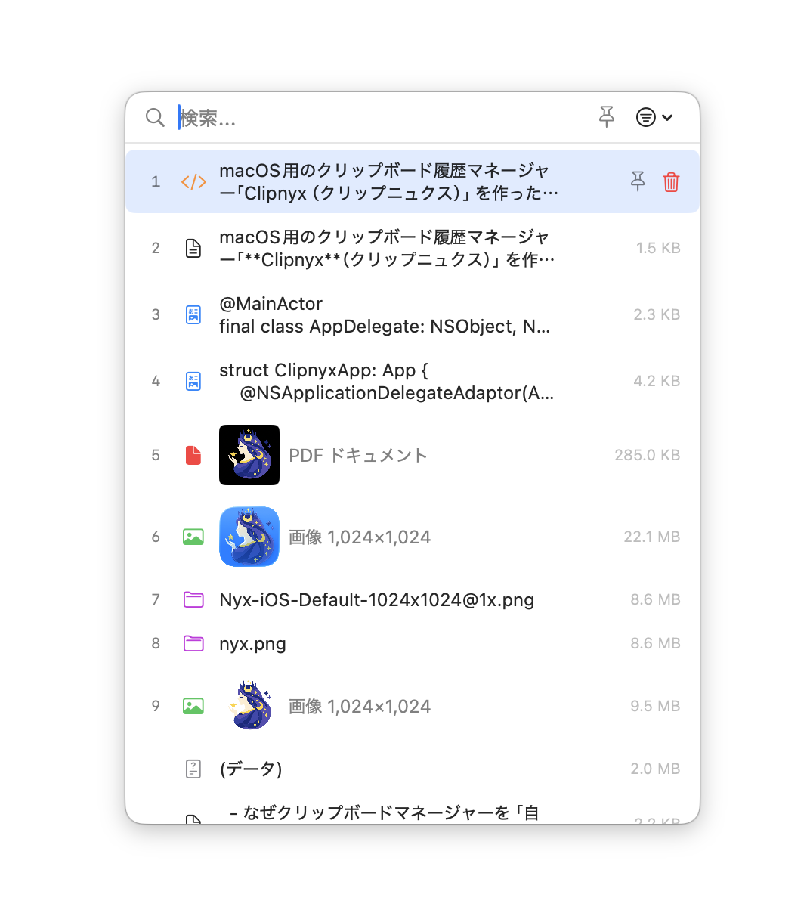
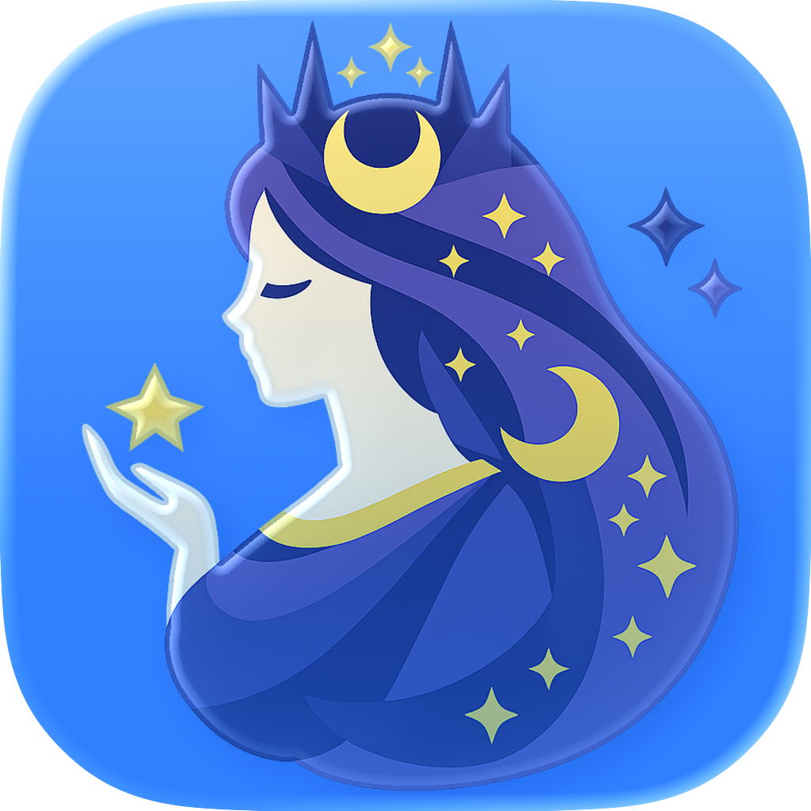

# 5時間で作ったMacアプリをHomebrewで公開した話

## はじめに

macOS用のクリップボード履歴マネージャー「**Clipnyx**」を作った。開発開始からHomebrewで公開するまでの経緯を書く。

公式サイト: https://sawasige.github.io/clipnyx/

## Clipnyxとは

メニューバーに常駐する軽量なクリップボード履歴マネージャー。主な機能は以下の通り。

- **クリップボード履歴** — コピーした内容を自動で保存。テキスト・画像・ファイルなど、あらゆる種類のデータに対応
- **ホットキーで瞬時アクセス** — グローバルホットキーで履歴パネルを即座に表示。どのアプリからでもすぐにペーストできる
- **お気に入り・フォルダ** — よく使うアイテムをお気に入りに登録して自動削除から保護。ユーザー定義のフォルダで整理できる
- **コレクション画面** — 全データの管理画面。履歴の閲覧・検索・お気に入り登録・テキスト編集ができる
- **自動カテゴリ分類** — URL、コード、カラーコード、電話番号など11カテゴリに自動分類
- **プレーンテキスト変換** — リッチテキスト、HTML、URL等をプレーンテキストに変換可能
- **プライバシー重視** — データはすべてMac上にローカル保存。外部送信やトラッキングは一切なし

App StoreとHomebrewの2チャンネルで配信している。

## なぜ作ったか

Windows時代からクリップボード履歴マネージャーをずっと使ってきた。

- **[CLCL](https://nakka.com/soft/clcl/)**（Windows） — Alt+Cでホットキー呼び出し、システムトレイ常駐の老舗フリーソフト
- **[ClipMenu](https://github.com/naotaka/ClipMenu)**（Mac） — Macに移行して使い始めた。その後開発停止しオープンソース化
- **[Clipy](https://github.com/Clipy/Clipy)**（Mac） — ClipMenuのコードベースを引き継いだ後継アプリ。直近まで使っていた

Clipyに大きな不満はなかったが、UIが古臭いのと開発が進んでいないように見えた。[Maccy](https://maccy.app/)や[Paste](https://pasteapp.io/)といった最近のクリップボードマネージャーは知っているが、自分には豪華すぎる。

自作の動機は**単純に何かMacアプリを作りたかった**のがいちばんの理由。Macアプリの開発自体がすごく久しぶりで、Claude Codeを使えば簡単に思い通りのものが作れそうだった。課金してるし高いからもったいない、というのもある。

以前Windowsで**Special Launch**というランチャーアプリを公開していた。同分野では国内で1位2位を争うほど評判が良かった。アイコンに星をモチーフにしていたことが、後のClipnyxの命名にもつながっている。

## 初日の5時間

2026年2月25日、14:50に「ClipboardHistory」として初コミット。そこから5時間で基本機能が完成した。

- 14:50 初コミット
- 14:59 ログイン時起動
- 15:58 メニューバーアイコン、署名
- 16:21 アプリアイコン（初日に2回変更）
- 16:41 ホットキーのカスタマイズ
- 16:52 ターミナルへの貼り付け対応
- 16:56 ポップアップパネルの背景改善
- **17:53 Clipnyxに改名**
- 19:17 App Sandbox有効化
- 19:54 App Store提出準備

コードはほぼすべてClaude Codeが書いた。手書きはない。自分がやったのは方針を伝えること、動作確認、そしてダメ出し。

## アプリ名 — Clip + Nyx

最初の名前は「ClipboardHistory」。ありきたりすぎる。

機能がある程度形になった16:56以降、名前探しを始めた。「クリップボードを想起する単語 + 個性を表す名前」という方針で、Claude Codeに候補を大量に出させた。同時に、同名のアプリが既に存在しないかを調査させた。

結構たくさん候補を出したが、同じ名前のアプリがあることが多く、決定まで時間がかかった。約1時間の検討の末、**Clipnyx**に決定。翌日にプロジェクト全体をリネームした。

**Nyx（ニュクス / Νύξ）** はギリシャ神話の夜の女神。

- 女神というのがかっこいい
- Special Launchで星をモチーフにしていたので、夜の女神とのつながりを感じた
- 発音はしづらいが、逆にかっこいいと思った。LinuxとかGnuとか読み方がわからない単語がかっこいい
- 他に同名のアプリがなかった

ボツ案は…もう覚えていない。

## アイコン

アプリアイコンは**ChatGPT**で生成した。「夜の女神」「立体感がない」「背景透明」などを指示して、出てきた画像をそのまま使っている。

これが実際のアプリアイコン。背景と立体感が加わっている。

メニューバーのアイコンも最初は女神ベースだったが、小さすぎてわかりづらい。クリップボードをモチーフにしたデザインに変更した。

## Homebrewで公開するまで

初日から8日後の3月4日、v1.0.0をリリースした。GitHub Actionsで署名・公証・DMG作成・Homebrew Cask更新を自動化し、brew install sawasige/clipnyx/clipnyx でインストールできるようにした。

ただ、この日はCIとの格闘が続いた。

### 1日6リリース

- **v1.0.0**（11:36）初リリース！…しかしHomebrew CaskのURLが間違い
- **v1.0.0**（再）Cask URLを修正
- **v1.1.0**（14:54）Sparkle自動アップデート追加。しかしApp Store版にSparkleが混入
- **v1.1.1**（18:53）ワークフロートリガーを変更
- **v1.1.2**（19:02）リリース作成順序を修正（重複タグエラー）
- **v1.1.3**（19:29）アプリアイコンが表示されない問題を修正
- **v1.1.4**（19:43）CIランナーをmacos-26に変更（Icon Composer対応）

YAML構文エラー、sign_updateパス、Sparkle除外忘れ、detached HEAD、重複タグ…全部踏んだ。CIパイプラインは実際にリリースしてみないとわからないことが多い。

## App Storeにも出した

Homebrewだけでなく、App Storeにも出した。Analyticsを仕込んでいないので、ダウンロード数などをApp Storeから確認したかったのが動機。

### リジェクトされた

初回提出（2/26）から5日後にリジェクト。理由は**Guideline 2.4.5**（Accessibility）。

> The app requests access to Accessibility features on macOS but does not use these features for accessibility purposes.

App Store版ではAccessibility APIを一切使っていない。コンパイルフラグで除外していたが、レビュアーに伝わらなかった。その旨を返信して再提出し、6日後に承認された。初回提出から承認まで約2週間。

ただしこれは「クリップボードにコピーするだけ」版での承認。App Store版ではダイレクトペースト（プログラムから ⌘V を送信する機能）をまだ実現できておらず、審査との格闘は継続中。

### 2エディション並行運用

現在は2つのエディションを並行運用している。

- **App Store版**: サンドボックス、Sparkleなし、Xcode Cloudでビルド
- **Full版（Homebrew）**: サンドボックス + Sparkle自動更新、GitHub Actionsでビルド

Full版のリリースワークフローの最後にバージョンタグを作成・プッシュするステップがあり、これがXcode Cloudのトリガーになる。つまりFull版をリリースするだけで、App Store版のビルドも自動で走る。

## 作っては消し、また作った機能

### スニペット → ピン留め（v1.2.0）

最初にスニペット機能を実装した。フォルダ管理、日付などの変数展開付きのテキストスニペットで、7ファイルかけて作り込んだ。

しかし使ってみると微妙だった。

- 履歴とスニペットで操作感が違う
- メニューバーとポップアップで見た目が似ているのに挙動が違う
- 変数展開もあまり便利じゃなかった

全部消して、代わりに履歴アイテムに「ピン留め」フラグを追加しただけにした。7ファイル削除してコードは大幅にシンプルになった。

### ピン留め → お気に入り・フォルダ（v1.3.0）

ピン留めだけでは物足りなくなった。よく使うアイテムにはちゃんと名前を付けて整理したい。

そこで「お気に入り」機能を導入した。ピン留めの上位版で、名前を付けてユーザー定義のフォルダで整理できる。ペーストパネルではTabキーでフォルダを横スクロールのチップで切り替えられる。

さらに「コレクション画面」を追加。全履歴とお気に入りをサイドバー付きの管理画面で閲覧・編集できるようにした。

つまり、スニペットで作ろうとしていた「よく使うテキストを整理して呼び出す」機能は、お気に入り・フォルダ・コレクション画面として形を変えて復活した。最初から正解にたどり着くのは難しい。

## Claude Codeで開発して

コードはほぼすべてClaude Codeが書いた。手書きはない。アイコンの生成だけはChatGPTを使った。

### CLAUDE.md

プロジェクトのルートに CLAUDE.md というファイルを置くと、Claude Codeがそれを読んで文脈を理解してくれる。Clipnyxでは以下のようなことを書いている。

- **プロジェクト概要**: 「macOS メニューバー常駐のクリップボード履歴マネージャー。SwiftUI + Swift 6、macOS 15.0+対象」
- **ビルドコマンド**: xcodebuildのコマンドをそのまま記載。Claude Codeがビルド確認できる
- **プロジェクト構造**: ディレクトリとファイルの一覧に、各ファイルの役割をコメントで添えている
- **アーキテクチャ**: 「@Observableパターンを使用」「0.5秒間隔でNSPasteboardをポーリング」「ホットキーはCarbon APIで登録」など、設計判断を明記
- **ビルド構成**: Debug/Release（App Store版）とDebug-Full/Release-Full（Full版）の違い、コンパイルフラグの意味
- **コミット規約**: 「コミットメッセージは日本語」「Co-Authored-Byは付けない」「mainに直接コミットしない」

特に効果的だったのは**アーキテクチャの方針**を書いておくこと。「なぜCarbon APIを使うのか」「なぜCGEvent.postでペーストするのか」といった設計判断の理由まで書いておくと、Claude Codeが勝手に別の方法に変えてしまうことが減る。

### 開発サイクル

基本的なサイクルはこう：

1. 方針を伝える（「スニペット機能を消してピン留めに統合して」等）
2. Claude Codeがコードを書く
3. ビルドして動作確認する
4. ダメ出しする（「治ってない」「動かない」「そうじゃない」）
5. 2〜4を繰り返す

大きな変更のときは「プラン」を先に書かせる。v1.2.0のUI統一リデザイン（スニペット廃止・ピン留め導入・ビュー統合）では、変更するファイルの一覧、削除するファイル、各ファイルの修正内容を事前にプランとしてまとめさせてからレビューし、合意してから着手した。

### AIが得意だったこと

- **名前の候補出し＋調査**: 候補を大量に生成して、同名アプリがないかをWeb検索で調査するところまで一気にやってくれる
- **ローカライズ**: 日英の翻訳ファイル（String Catalog）の作成・更新
- **CI/CDワークフロー**: GitHub Actionsの署名・公証・DMG作成・Homebrew Cask更新のパイプラインを一から構築
- **大規模リファクタリング**: スニペット→ピン留め→お気に入りの移行。複数ファイルの同時修正を整合性を保ったまま実行
- **名前のリネーム**: 「スニペット→お気に入り、カテゴリ→フォルダ」のような全体リネームを、ソースコード・UI文言・ローカライズまで一括で対処

### AIが苦手だったこと

- **macOS固有のウィンドウ挙動**: ドキュメントに書かれていないAPI挙動への対処が苦手。一度ハマると同じような修正を繰り返しがち
- **UIの感覚**: フォントサイズ、レイアウト、操作の導線といった「使ってみないとわからない」部分は人間が判断する必要がある
- **問題の切り分け**: 思い通りに動かないとき、人間が「問題はそこじゃない」と方向を変えてあげる必要がある

## 数字で見るClipnyx

- 開発開始: 2026/2/25 14:50
- 初リリース（v1.0.0）: 2026/3/4
- 最新バージョン: v1.3.0（3/26）
- 総コミット: 170
- 対応macOS: 15.0+
- 言語: Swift 6 / SwiftUI
- ローカライズ: 日本語・英語
- 配信: App Store / Homebrew / DMG

## 今後

まだまだ改善したいことはたくさんある。ただし重くならない程度に。

クリップボードマネージャーは地味なアプリだが、毎日使うものだからこそ自分好みにしたい。CLCL、ClipMenu、Clipyと使い続けてきた系譜の先に、自分で作ったものがあるのはちょっとうれしい。

興味があればぜひ試してみてほしい。

**Clipnyx 公式サイト**: https://sawasige.github.io/clipnyx/
